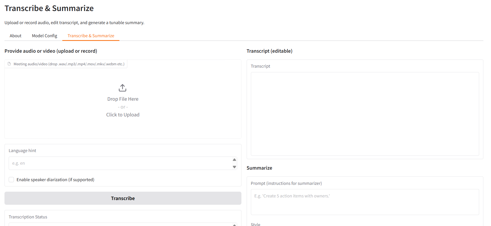

# Voice2Text – Transcribe & Summarize Meetings

Voice2Text is a lightweight web UI that uses AI to transcribe audio/video files and generate meeting summaries.  
It is designed for seamless deployment inside HPE Private Cloud AI environments using Helm charts, but can also be run in a standard Docker environment.

---

## Overview

The application provides:

- Audio and video upload or recording
- Automatic transcription using a Whisper-compatible API defined in the Model Config tab
- Chunked transcription for long audio files
- Editable transcript view within the UI
- Summary generation using a GPT-OSS/OpenAI-compatible API
- Local persistence of configuration values in `model_settings.json`
- Production-ready Docker image and Helm chart deployment

---

## Architecture

```[ Insert Architecture Here]```

```
+-----------------------+
| User (Web Browser) |
+----------+------------+
|
v
+-------------------------------+
| Voice2Text UI (Gradio-based) |
| - File upload / recording |
| - Config management |
| - Transcript editing |
| - Summary generation |
+----------+--------------------+
|
v
+-------------------------------+
| Whisper API (local endpoint) |
| Transcription backend |
+-------------------------------+
|
v
+-----------------------------------------------+
| GPT-OSS / OpenAI-compatible summarizer API |
| Summary generation backend |
+-----------------------------------------------+
```

---

## Deployment on HPE Private Cloud AI

The repository includes all files required to deploy the application into an HPE Private Cloud AI environment.

### Deployment steps

1. Navigate to the AI Essentials interface.
2. Select "Import New Framework".
3. Upload the Helm chart file:
```voice2text.x.x.x.tgz```
4. Deploy the framework.
5. After deployment, open the application UI and configure:
- Whisper API endpoint
- Whisper API token
- Whisper model name
- Summarizer API endpoint
- Summarizer API token
- Summarizer model name

The UI includes placeholders demonstrating the expected format for these values.

All configuration is stored persistently within:
```/app/model_settings.json```

---

## Docker Usage (Optional)

Although Helm deployment is the primary use case, the application can also be run locally with Docker.

### Basic run

```
docker run -d
--name voice2text
-p 7860:7860
vinchar/voice2text:latest
```

---

## Configuration Details

All configuration is performed inside the **Model Config** tab of the UI.  
No environment variables are required at runtime.

### Parameters

| Field                    | Description                                                  |
|--------------------------|--------------------------------------------------------------|
| WHISPER_API_URL          | URL of the Whisper-compatible transcription backend          |
| WHISPER_API_TOKEN        | Optional authentication token                                |
| WHISPER_MODEL_NAME       | Model name required by the backend                           |
| SUMMARIZER_API_URL       | URL of the summarizer backend (OpenAI-compatible endpoint)   |
| SUMMARIZER_API_TOKEN     | Optional authentication token                                |
| SUMMARIZER_MODEL_NAME    | Model name required by the summarizer engine                 |

### Clearing configuration

The "Clear All Model Settings" button performs the following:

- Resets all values in `model_settings.json`
- Resets in-memory configuration
- Clears all form fields in the UI (restores placeholders)

---

## UI Overview

A screenshot should be placed here once available:



---

## Repository Structure

| File/Folder              | Description                                                                 |
|--------------------------|-----------------------------------------------------------------------------|
| Dockerfile               | Used to package the UI into a runnable Docker image                         |
| app.py                   | Main Python/Gradio application                                              |
| requirements.txt         | Python dependencies                                                         |
| icon.png                 | Icon used in AI Essentials when deploying via Helm                          |
| logo.png                 | Logo embedded into the Gradio UI                                            |
| helmchart/               | Unpacked Helm chart                                                         |
| voice2text.x.x.x.tgz     | Packaged Helm chart used for deployment in HPE Private Cloud AI             |

---

## How It Works

1. User uploads or records an audio/video file.
2. Application converts the media into a normalized WAV format when needed.
3. Transcription is performed by the configured Whisper API.
   - Long files are chunked for improved reliability.
4. Transcript appears in the UI and can be edited.
5. User requests a summary via the configured GPT-OSS/OpenAI-compatible API.
6. Summary is displayed and can be downloaded along with the transcript.

---

## Troubleshooting

### Whisper API not reachable

Use the "Test Transcription Connection" button in the Model Config tab.

### Summarizer API not reachable

Use the "Test Summarizer Connection" button.

---

## Acknowledgements

This project uses:

- Gradio for the web UI
- ffmpeg for media processing
- Whisper-compatible APIs for transcription
- GPT-OSS/OpenAI-compatible APIs for summarization
- Dave & Jaro and all the HPE Private Cloud AI Central Europe SE Team